# HeartSync

An Android music app built with **Kotlin** and **Jetpack Compose** that helps users match music to different energy states through **BPM-based modes**, **daily goals**, and **offline-first playback**.

---

## Demo


> - A short **demo video** or GIF showing the core user flow
> - An **APK download link** if you want others to try the app
> - Optional: a short caption explaining what each screen demonstrates

## Screenshots

### Splash Screen
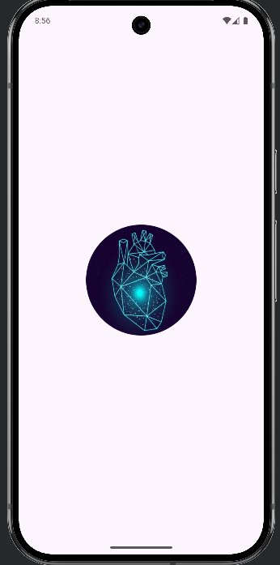

The splash screen provides a branded entry point before users proceed to authentication. It reflects the visual identity of the app through the geometric heart logo and establishes the overall design language of HeartSync.


### Welcome Screen
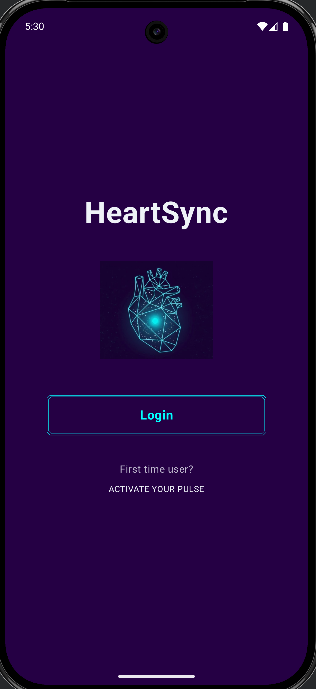

The welcome screen introduces the HeartSync brand with a prominent title and animated logo. The pulsing logo is designed to evoke the feeling of a heartbeat and reinforce the app’s music-and-rhythm theme. First-time users can tap **ACTIVATE YOUR PULSE** to begin the registration flow.

### Log in Page
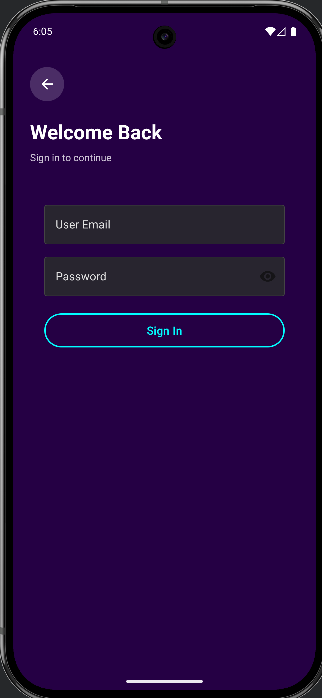
The login screen continues the app’s futuristic visual style through a dark background, high-contrast typography, and a neon-blue sign-in button. Users can sign in with their registered account to access personalized data and synced features.

### Create Account page
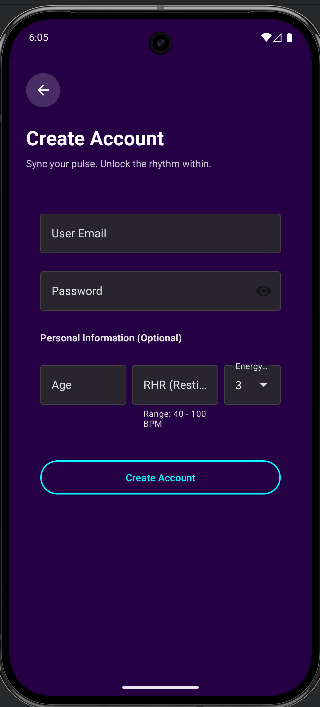
The account creation screen allows users to register with a username, an email address and password. Users can also optionally provide profile data such as age, resting heart rate (RHR), and preferred energy level. These values are currently stored with default fallbacks when omitted, and are intended to support future personalization and recommendation logic.

### Terminal Page


|  |  |  |
|-------|-------|-------|
| 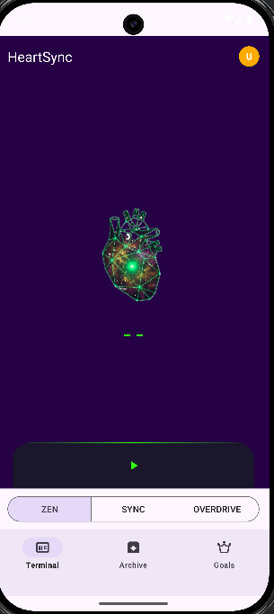 | 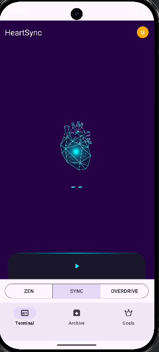 | 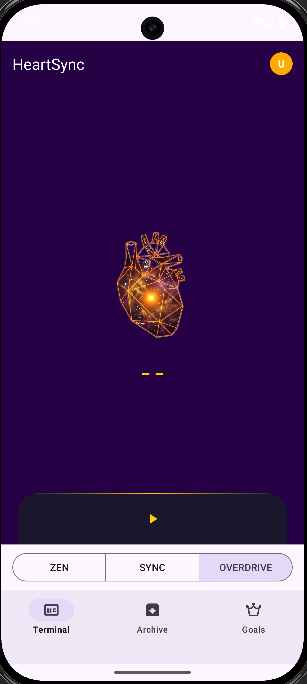 |

The Terminal page is the core playback screen of the app. Users can choose from three modes — **ZEN**, **SYNC**, and **OVERDRIVE** — each represented by a distinct color theme and listening intensity.

When users first enter the page, the app simulates a state where no heart-rate device is connected. The heart animation pulses subtly and the BPM display shows `--`. Once playback begins, the app starts fetching music from the API, mock heart-rate values begin updating, and the heart animation responds according to the selected mode.

|  |  |  |
|-------|-------|-------|
| 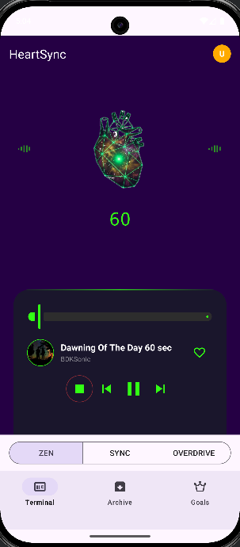 | 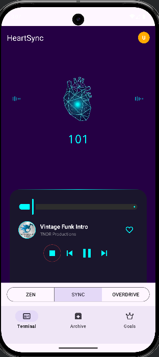 | 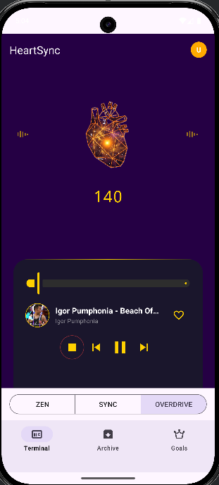 |

During playback, users can view the album artwork, track title, and artist name. A progress bar shows the current playback position and supports scrubbing. Tapping the heart icon adds the song to **Collections**; tapping it again removes the song from the saved list.

### Archive

#### Sessions
<p align="center">
  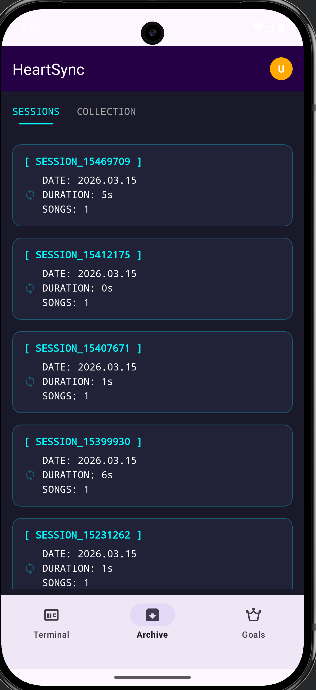
  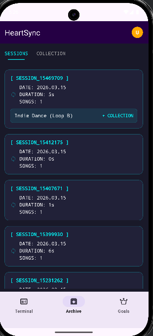
  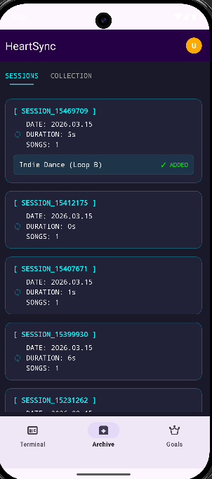
</p>
The Sessions screen displays listening history in a card-based layout, ordered from newest to oldest. Each card includes the playback mode, listening date, duration, and number of songs played. Users can expand a card to view more details and add tracks to **Collections**. Saved tracks are marked as added, and can also be removed from the collection from the same view. The app currently keeps the most recent 50 sessions, and users can swipe left to delete entries they no longer want to keep.

#### Collections
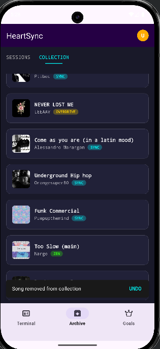
The Collections screen shows songs the user has previously saved. Each item includes album artwork, track title, artist name, and the playback mode associated with the track.

### Goals Page

#### Daily Goals
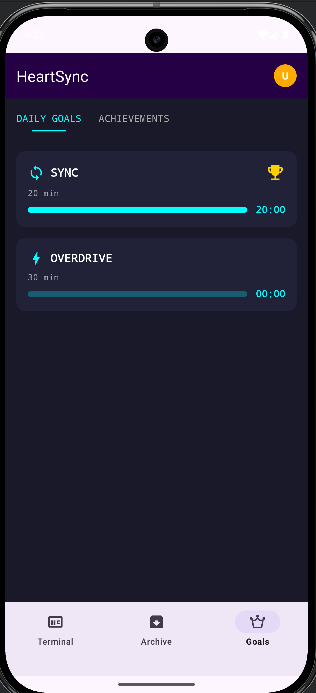
The Daily Goals screen generates two random daily challenges by selecting modes and target durations between 10 and 30 minutes in 5-minute increments. When a goal is completed, a trophy appears to indicate success, and the result is counted toward monthly achievements.

#### Achievements
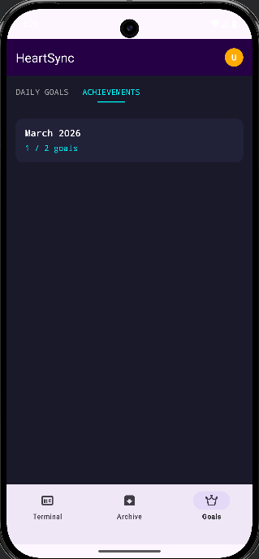

The Achievements screen tracks completed daily goals by month. Each completed goal increases the monthly completion count. Since the app generates two daily challenges, completing one goal in a day would display progress such as `1/2`. If no goals are completed the next day, the total would become `1/4`. At the start of a new month, the monthly count resets and begins again from `0/2`.

### User Account Page
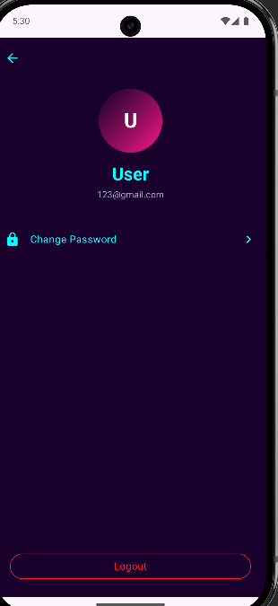

The User Account page allows users to update their profile avatar, edit their username, and manage account-related settings. The email address is tied to the registered account and cannot be changed from this screen.

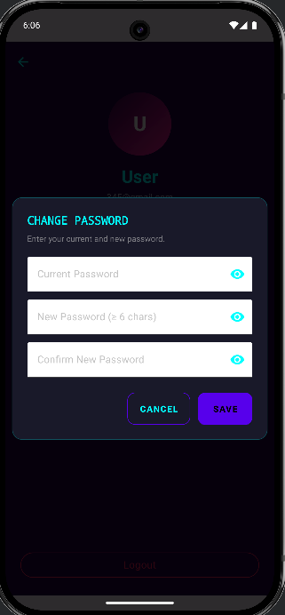
Tapping **Change Password** opens a dialog where users can update their password securely.


### Demo Video
[Add demo video link here]

### APK
[Add APK download link here]

---

## Overview

HeartSync is an Android music application built with Kotlin and Jetpack Compose that connects music playback with BPM-based activity modes: **ZEN**, **SYNC**, and **OVERDRIVE**. Instead of focusing on only one use case such as workouts or meditation, HeartSync is designed as a single music companion for different energy states throughout the day.

Users can choose a mode based on their current goal: calming down, maintaining rhythm, or boosting energy. The app then plays randomly selected tracks that match the target BPM range, creating a lightweight and surprising listening experience rather than requiring users to manually search for songs each time.

Beyond playback, HeartSync also includes **daily goals**, **session history**, **favorites collection**, **monthly achievements**, and **offline-first audio fallback**. Together, these features turn the app from a simple music player into a habit-forming product that supports both entertainment and routine building.

---

## Problem

Most music and wellness apps are designed around a **single activity**. A user may need one app for exercise, another for relaxation, and another for casual music listening. This creates a fragmented experience where users constantly switch between apps depending on their situation.

**What if one app could support multiple energy states and activities through music alone?**

HeartSync makes it come ture.

- Users often want music that matches how they feel or how they want to feel
- Manually searching for the “right” playlist every time creates friction
- Many apps do not encourage ongoing engagement beyond one-time playback

HeartSync addresses this by combining **mode-based music playback**, **heart-rate-inspired interaction**, and **goal tracking** into one experience. The goal is to make music selection feel more immediate, adaptive, and engaging whether the user wants to relax, stay focused, work out, or just discover something new.

---

## Solution

HeartSync solves this problem by organizing playback into three BPM-based modes:

- **ZEN** for lower-energy, calming listening
- **SYNC** for steady, balanced listening
- **OVERDRIVE** for higher-energy listening

For each mode, the app fetches music from the **Jamendo API**, filters it by BPM-related logic, and plays tracks in a randomized flow so users can quickly start listening without browsing large libraries. To make the experience more reliable, the app also supports **offline-first playback** through **Firebase Storage** and bundled fallback audio.

To improve retention and make the app feel more interactive, HeartSync also includes:

- **Daily goals** with real-time progress tracking
- **Session history** so users can review what they listened to
- **Collections** for saving favorite tracks
- **Monthly achievements** to reinforce consistent usage

From a product perspective, the app combines **music discovery**, **lightweight personalization**, and **habit-building mechanics** in a single experience. From an engineering perspective, it demonstrates end-to-end Android development including media playback, offline support, local persistence, cloud integration, and reactive UI state management.

---

## Why This Project Matters

This project matters to me because it is not just a media player — it is an attempt to design a more cohesive product experience around **music, mood, and activity state**.

From an engineering perspective, I built HeartSync to demonstrate skills in:

- Android architecture with **MVVM**, repositories, and reactive state flows
- Modern UI development using **Jetpack Compose** and **Material 3**
- Media playback systems using **Media3 ExoPlayer** and **MediaSession**
- Offline-first design with **Room**, Firebase Storage fallback, and resilient playback transitions
- Cloud integration with **Firebase Auth**, **Firestore**, and **Storage**
- API integration with **Retrofit** and **Jamendo**
- Dependency injection with **Hilt**

From a product perspective, I wanted to build something that feels more intentional than a basic CRUD app. HeartSync reflects how I think about software projects: not only as technical implementations, but as systems that should solve a clear user problem, reduce friction, and encourage repeated use.

---

## App Highlights

- **BPM-based adaptive music** — Three modes (**ZEN 50–80**, **SYNC 80–120**, **OVERDRIVE 120–160 BPM**) with mode-specific Jamendo API discovery
- **Real-time heart rate simulation** — `MockHeartRateProvider` emits BPM every second and drives the geometric heart animation
- **Offline-first playback** — Jamendo → Firebase Storage cache → bundled fallback; network failures automatically switch to local audio
- **Daily goals with live progress** — Two goals per day with accumulated seconds updated in real time while the matching mode is playing
- **Per-user data isolation** — Goals and achievements are scoped by Firebase Auth `userId`

---

## User Features

- **Music playback** with ExoPlayer (streaming + local fallback)
- **Mode switching** — ZEN / SYNC / OVERDRIVE
- **Jamendo-powered discovery** — Up to 200 tracks per mode using BPM, speed, and tag-based filtering
- **Offline fallback** — Essential Firebase Storage audio files (`zen.mp3`, `sync.mp3`, `overdrive.mp3`) used when API results fail or network is unavailable
- **Collection** — Save and remove favorite songs by mode
- **Archive** — Review listening sessions, durations, and saved tracks; supports swipe-to-delete with undo
- **Daily goals** — Two random goals per day with progress bars and completion crowns
- **Monthly achievements** — Track completed vs. total goals per month
- **Authentication** — Email/password sign-up and login
- **Profile & Bio** — Store user information such as age, weight, resting BPM, max heart rate, and energy level
- **Background playback** — MediaSession support for lock screen controls, notifications, and media buttons
- **Terminal-style UI** — Geometric heart animation, BPM display, and mode-specific color accents

---

## Technical Details

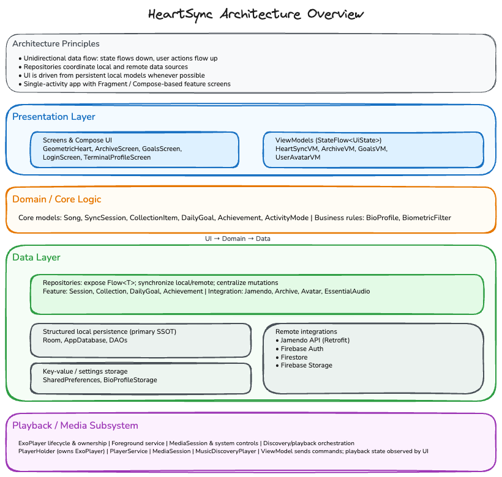

- **MVVM architecture** — Clear separation across UI, ViewModels, repositories, and data sources
- **Reactive UI** — `StateFlow`, `Flow`, `combine()`, and `collectAsStateWithLifecycle`
- **Dependency injection** — Hilt across the application, activities, fragments, and view models
- **Local-first data design** — Room as the source of truth with Firestore synchronization in the background
- **Offline caching** — Room for sessions, goals, achievements, and collections; Firebase Storage plus bundled files for essential audio
- **Network resilience** — Automatic playback transition logic for user pause, mode switch, and fallback handling
- **Per-user isolation** — `userId` filtering applied to goal and achievement data
- **Firebase integration** — Auth, Firestore, and Storage
- **Media playback infrastructure** — Foreground `PlayerService`, shared ExoPlayer holder, MediaSession integration
- **Configuration management** — `JAMENDO_CLIENT_ID` loaded from `local.properties`

---

## Key Technical Challenges

- Designing a playback flow that remains usable even when the Jamendo API fails or the network is unstable
- Building a local-first data model with Room while keeping Firebase-backed user data isolated and synchronized
- Managing shared media playback state across screens using ExoPlayer, MediaSession, and foreground service patterns
- Structuring a multi-feature Android app with MVVM and reactive state so playback, goals, sessions, and profile data remain maintainable

---

## Tech Stack

### Language
- Kotlin 2.1.0

### UI
- Jetpack Compose
- Material 3
- Material Icons Extended
- Coil

### Architecture
- MVVM
- Local-first repositories

### Dependency Injection
- Hilt 2.51.1
- KSP

### Networking
- Retrofit 2.11.0
- Gson
- Jamendo API v3.0

### Database
- Room 2.8.4

Entities include:
- `collection`
- `sync_sessions`
- `user_profile`
- `daily_goals`
- `achievements`

### Firebase
- Firebase Auth
- Firestore
- Firebase Storage
- Firebase Analytics  
- Firebase BOM 34.5.0

### Concurrency
- Kotlin Coroutines
- Flow
- StateFlow

### Media
- Media3 ExoPlayer 1.8.0
- Media3 Session

### Navigation
- Navigation Compose 2.7.7
- Bottom navigation with Fragments

### Lifecycle
- `lifecycle-viewmodel-compose`
- `lifecycle-runtime-compose`

## Testing

The project currently includes unit tests for core profile-mapping and biometric intensity logic.

### Testing Stack
- **JUnit** for unit testing
- **kotlinx-coroutines-test** for coroutine and ViewModel-related test support
- **Espresso** dependencies added; UI test coverage is still in progress

### Current Coverage
- **Registration mapping logic** — input parsing, default handling, boundary cases, and clamping
- **Bio profile logic** — energy level to multiplier mapping and invalid fallback behavior
- **Biometric intensity logic** — intensity calculation across resting/max BPM, midpoint values, clamping, and safe denominator handling

### Result
- **26 tests completed, 0 failed**

### Run Tests
```bash
./gradlew testDebugUnitTest


### Tools
- Git / GitHub
- Firebase Console
- Android Studio
- Gradle
- Node.js / npm
- Jamendo API
- `local.properties`

### Other Android Components
- AppCompat
- Material Components
- ConstraintLayout
- RecyclerView
- Fragment KTX

---

## Architecture

This project follows **MVVM (Model–View–ViewModel)** to improve maintainability, scalability, and separation of concerns.

## Setup  （TODO!!）
- `Getting Started`
- `Setup / Environment Variables`
- `Firebase Configuration`
- `Jamendo API Setup`
- `Project Structure`
- `Known Limitations`


## Future Improvements
- Replace mock heart-rate simulation with wearable or real sensor integration
- Integrate the existing bio profile data (`age`, `resting BPM`, and `energy level`) into the playback logic so user-specific intensity calculations can influence music selection and adaptive mode behavior
- Add personalized recommendation logic based on listening history, favorites, skips, session patterns, and bio profile data
- Introduce smart mode suggestions and behavior-aware daily goals instead of relying only on manual mode selection and random goal generation
- Add AI-generated listening summaries or coaching insights to improve personalization and user engagement
- Add Espresso-based UI tests for critical user flows such as authentication, mode switching, and goal progress interactions


### Layers

#### Presentation Layer
- **UI**
  - Activities: `MainActivity`, `LoginFormActivity`, `RegisterActivity`, `UserProfileActivity`, `HistoryActivity`, `EditProfileActivity`
  - Fragments: `TerminalFragment`, `SyncEngineFragment`, `ArchiveFragment`, `GoalsFragment`, `SettingsFragment`
  - Compose screens: `GeometricHeartContent`, `HeartSyncBpmContent`, `GoalsScreen`, `ArchiveScreen`, `EditProfileScreen`, `LoginScreen`, `TerminalProfileScreen`
- **ViewModels**
  - `HeartSyncViewModel`
  - `GoalsViewModel`
  - `ArchiveViewModel`
  - `EditProfileViewModel`
  - `UserAvatarViewModel`
- **UI State**
  - `StateFlow`
  - `Flow`
  - `collectAsStateWithLifecycle`

#### Data Layer
- **Repositories**
  - `JamendoRepository`
  - `LibraryRepository`
  - `ArchiveRepository`
  - `EssentialAudioRepository`
  - `CollectionRepository`
  - `SessionRepository`
  - `DailyGoalRepository`
  - `AchievementRepository`
  - `AvatarRepository`
- **Remote Sources**
  - Jamendo API via Retrofit
  - Firebase Auth
  - Firestore
  - Firebase Storage
- **Local Sources**
  - Room (`AppDatabase`, DAOs)
  - SharedPreferences (`BioProfileStorage`)

### Data Flow

```text
UI → ViewModel → Repository → Remote API / Local Database